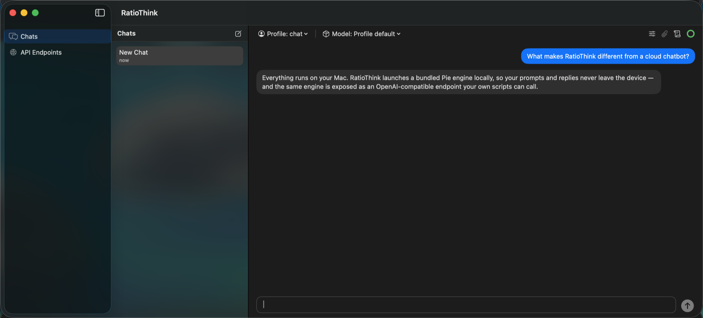
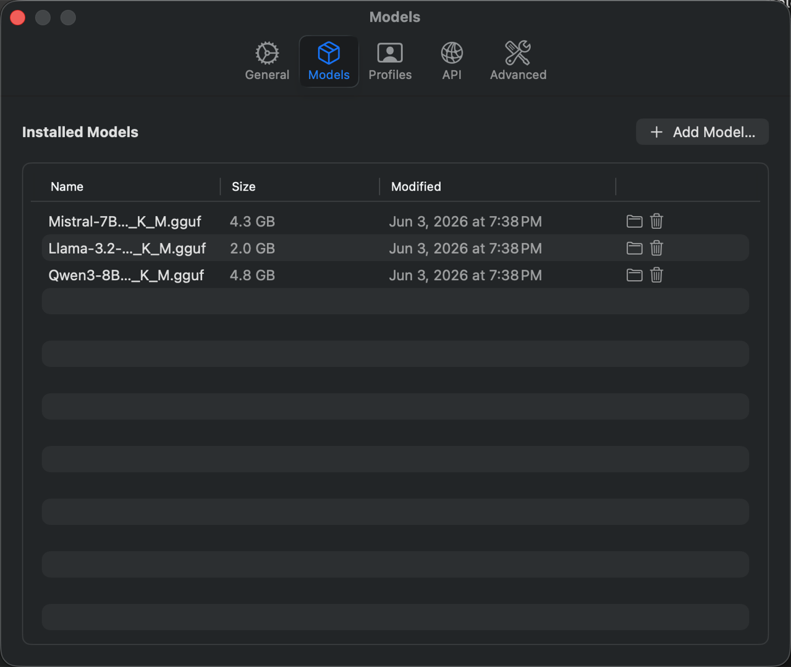
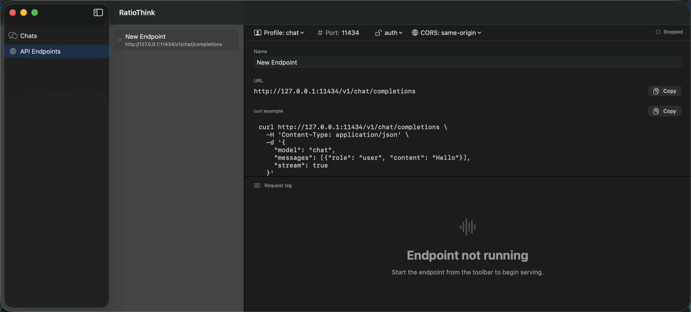

<div align="center">


# RatioThink

**Private, local AI chat for macOS — powered by your own models.**

RatioThink is a native macOS app that runs large language models entirely on your
Mac through a bundled [Pie](https://github.com/pie-project/pie) inference engine. Chat
offline, manage your models, and expose an OpenAI-compatible HTTP endpoint your own
scripts can call — no account, no cloud, no data leaving the device.


<br />



</div>

> Screenshots show the actual app UI. Chat replies and the installed-model list are
> illustrative — generated against a local test engine, not a real model.

## What it is

RatioThink wraps the Pie engine in a SwiftUI + AppKit app and a menu-bar helper that
supervises the engine for you. You pick an open-weight model, load it, and chat — all
on-device. The same engine is published locally on an OpenAI-compatible endpoint, so
existing tooling (curl, the OpenAI SDKs, your own apps) can talk to it without changes.

## Features

- **Local chat** — Prompts and replies stream from a model running on your Mac. Nothing
  is sent to a server you don't control.
- **Model management** — Download curated GGUF models or import your own, and see size and
  status at a glance.
- **Engine status & loading** — A toolbar indicator shows when the engine is starting, a
  model is loading (with progress), ready, or failed — and lets you unload to free RAM.
- **OpenAI-compatible engine** — RatioThink's chat runs against a local OpenAI-style
  `/v1/chat/completions` engine. A screen to expose it on a fixed port (with a bearer token
  / CORS) for your own clients is in preview — see [Known issues](#known-issues).

<div align="center">



<sub><b>Model management</b> — download curated GGUF models or import your own.</sub>

<br />



<sub><b>OpenAI-compatible API (preview)</b> — configure a local endpoint and copy the curl; live serving is coming.</sub>

</div>

## Install (DMG)

Release DMGs are signed with a Developer ID and notarized by Apple, so they
pass Gatekeeper with no extra steps:

1. Download `RatioThink-arm64.dmg` (Apple Silicon) from
   [Releases](https://github.com/shsym/RatioThink/releases) and open it.
2. In the window that opens, drag **RatioThink.app** onto the **Applications** shortcut.
3. Open **RatioThink** from Applications and follow the first-launch wizard to download a
   starter model.

> **Unsigned / development builds.** A DMG or app you build yourself
> (`make dmg-arm64`) is *not* notarized, so Gatekeeper blocks it. For local
> use only, clear the quarantine flag — notarized release downloads never need
> this:
> ```bash
> xattr -dr com.apple.quarantine /Applications/RatioThink.app
> ```

## Updating

RatioThink does not auto-install updates yet, but it does **check** for them.

- **On launch**, it makes one request to the public
  [GitHub Releases](https://github.com/shsym/RatioThink/releases) API and, if a
  newer release exists, shows a dismissable banner with **Download** (opens the
  release page) and **Ignore this version** (that version stays hidden until a
  newer one ships). It stays silent if you're up to date or offline.
- **Anytime**, choose **RatioThink → Check for Updates…** to check on demand;
  the menu command always checks and ignores any dismissed versions.

Neither path downloads or installs anything automatically — they compare
versions and link you to the release. (In-app auto-update via Sparkle is tracked
as future work.)

## Build from source

**Prerequisites:** an Apple Silicon Mac (arm64), macOS 14+, Xcode (with command-line tools), [XcodeGen](https://github.com/yonaskolb/XcodeGen)
(`brew install xcodegen`), and a Rust toolchain (`rustup`) — the build compiles the bundled Pie engine.

```bash
git clone --recurse-submodules https://github.com/shsym/RatioThink.git
cd RatioThink
make build          # generates RatioThink.xcodeproj, then builds RatioThink.app + helper
```

The repo uses git submodules (the Pie engine, plus `ds_store` + `mac_alias` under
`Scripts/vendor/` which `make dmg-arm64` needs to write the styled DMG window). If
you cloned without `--recurse-submodules`, initialize them:

```bash
git submodule update --init --recursive
```

To install a signed build into `/Applications` (verified end-to-end: helper + engine + a chat
round-trip), use `make install-app`. It needs an Apple "Apple Development" signing identity in your
keychain; override `DEVELOPMENT_TEAM` / `CODE_SIGN_IDENTITY` per machine. The background helper is
registered via `SMAppService`, which refuses an unsigned/ad-hoc agent — so signing is required for a
working install.

```bash
make install-app    # build, sign, install into /Applications, launch, verify
```

`make install-app` uses a local **Apple Development** identity. That is enough
to run and debug locally, but it is *not* a distribution identity — Gatekeeper
rejects it on download. Producing a DMG that passes `spctl` on other Macs
requires the notarized release flow below.

## Troubleshooting / Collect diagnostics

If RatioThink "does nothing" after launch — no window, no menu-bar icon, no chat —
collect a diagnostics bundle and send it to the developer.

**From the app** (if it opens): **Help → Collect Diagnostics…**. It writes a
`.zip` to your Desktop and reveals it in Finder.

**From Terminal** (works even when the app or helper won't launch):

```bash
/Applications/RatioThink.app/Contents/Resources/collect-diagnostics.sh
```

This prints a short verdict (e.g. *quarantine present*, *helper never
launched*, *Gatekeeper rejected*, *engine failed*) and writes
`~/Desktop/RatioThink-diagnostics-<timestamp>.zip`. Attach that `.zip` to your
report.

The bundle contains app/helper versions, codesign + Gatekeeper + quarantine
status, the launchd helper state, the running-process list, recent macOS
Unified Logging for `com.ratiothink*`, recent crash reports, and the app's own
breadcrumb logs (`app.log` / `helper.log` / `engine.log`). It is **redacted**:
your home path is collapsed to `~` and obvious tokens are stripped. Chat
contents are **never** included — diagnostics carry logs, status, and config
metadata only. Flags: `--window <dur>` (Unified Logging look-back, default
`2h`) and `--out <path>`.

## Known issues

A few known issues in the v0.1.1 release, with workarounds:

- **The "Qwen2.5 7B Instruct" model in the list won't load.** Hugging Face publishes that
  quant as split files the bundled engine can't assemble yet, so downloading it leaves a
  model that fails to load. Pick a different model for now —
  [a fix is in progress](https://github.com/shsym/RatioThink/pull/41).
- **Cancelling a model download can be unstable.** While a model is downloading the
  progress can lag, and cancelling may not stop it as cleanly as expected — a partial
  download can be left behind. If one remains, remove it from the Models list;
  [a fix is in progress](https://github.com/shsym/RatioThink/pull/43).
- **The local API endpoint is a preview.** You can configure an endpoint in the API
  Endpoints screen, but it doesn't serve live requests yet — exposing a loaded model on a
  fixed port is still being built. Use in-app chat in the meantime.
- **The "Starting the engine…" prompt can rarely get stuck.** In an uncommon sequence — a
  model load waiting on the engine, then a model-list refresh failing — the prompt can stay
  on "Starting the engine…". Click **Cancel** and try again.
- **A reply can lose its last words if saving fails.** If storage errors out exactly as a
  streamed answer finishes, the saved copy may drop its final chunk (you'll see an error).
  Re-generate the reply.

## Repo layout

```
RatioThink/
├── App/            # Main SwiftUI app target (RatioThink.app)
├── Helper/         # SMAppService menu-bar helper (RatioThinkHelper.app)
├── Shared/         # Cross-target Swift library (RatioThinkCore: engine client, XPC, models, persistence)
├── Inferlets/      # chat-apc inferlet (Rust → wasm) + prebuilt artifact
├── Resources/      # App icon + asset catalog
├── Scripts/        # Build, packaging, and end-to-end test scripts
├── Sources/        # SPM CLI tools used by the test harness
├── Tests/          # XCTest unit, scenario, and GUI tests
└── Vendor/pie/     # Pie engine (vendored submodule)
```

## Documentation

- [`docs/ARCHITECTURE.md`](docs/ARCHITECTURE.md) — how the app, helper, pie engine, and
  `chat-apc` inferlet fit together (plus an interactive [`architecture.html`](docs/architecture.html)).
- [`TEST.md`](TEST.md) — test catalog and pre-PR gate: what to run for each change type.
- [`PARITY.md`](PARITY.md) — how each test tier maps to the real packaged-binary path, and every bypass it takes.

## License

[Apache-2.0](LICENSE)
